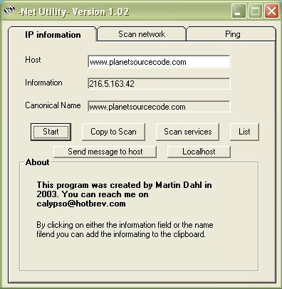



## Net utility

### Description

The program allows you to translate ip numbers into domain names and vice veers. You can scan a ip number for open services and you can do a ping. If you choose the "scan network" tab you can scan a range of ip numbers for a open port. For example if you choose port 80 you can see witch computers are running a web server.
 
### More Info
 

             |
---                |---
**Submitted On**   |2003-09-15 14:43:40
**By**             |[Martin Dahl](https://github.com/Planet-Source-Code/PSCIndex/blob/master/ByAuthor/martin-dahl.md)
**Level**          |Intermediate
**User Rating**    |4.3 (13 globes from 3 users)
**Compatibility**  |VB 4\.0 \(32\-bit\), VB 5\.0, VB 6\.0
**Category**       |[Complete Applications](https://github.com/Planet-Source-Code/PSCIndex/blob/master/ByCategory/complete-applications__1-27.md)
**World**          |[Visual Basic](https://github.com/Planet-Source-Code/PSCIndex/blob/master/ByWorld/visual-basic.md)
**Archive File**   |[Net\_utilit1649219232003\.zip](https://github.com/Planet-Source-Code/martin-dahl-net-utility__1-48498/archive/master.zip)

